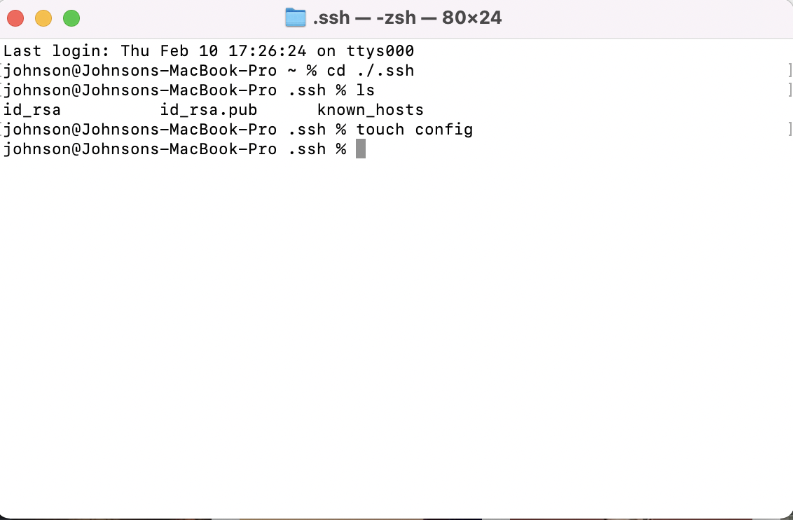
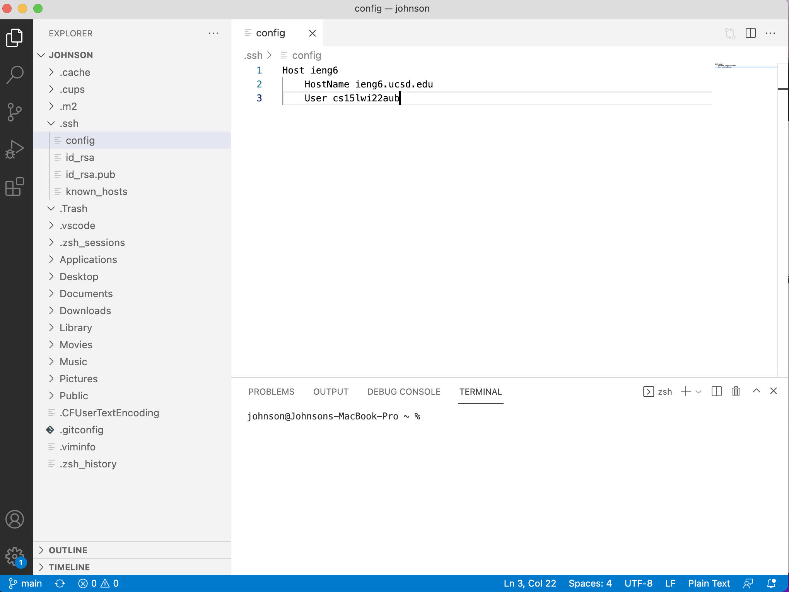
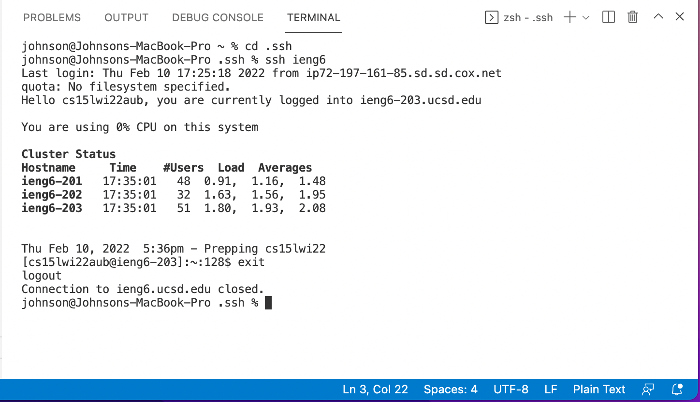
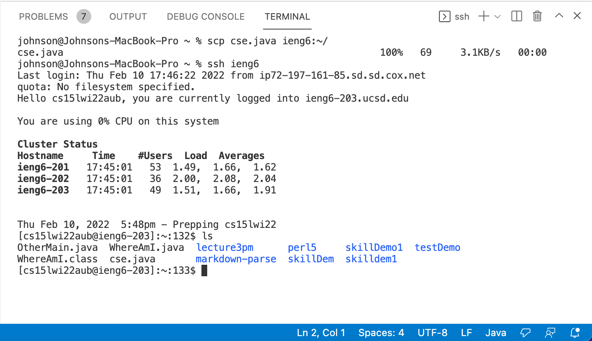

>
**Lab Report 3**
>
**Name:Junpeng(Johnson)Li**
>
**Professor Joe**
>
**CSE 15L**
>
___
>
# Create config file within `.ssh` directory and Edit in VSCode
___
>
First of all, we can use the terminal within macos system to check whether there exist the config file within the `.ssh` directory or not. If not, we can use the command 
```
touch config
```
to create a config file.
>

>
The following command is what I have done in the terminal:
>
```
cd ./.ssh
ls
touch config
```
>
Indeed, we need to change the current directory to ` .ssh` first, then we can check whether there exists a config file or not by using `ls`. If not, now we can `touch config` to create a brand new config file.
>
After creating the file, I can utilize VSCode to edit the content within the config file.
>
## VSCode Demonstration:
>

>
___
To add to the ssh config file:
>
```
Host ieng6
    HostName ieng6.ucsd.edu
    User cs15lwi22aub
```
>
___
# Using `ssh` command with the new Host name to log into the server
___
>
**command to log in to the server:**
```
ssh ieng6
```
>
## VScode ScreenShot:

>
This would obviously save some time of typing up the whole username within the log in process by directly using ssh the Host that we have added in the config file.
>
___
# `scp` a file to the server using just the alias I chose
>
I randomly create a file called `cse.java` in VScode. Then I use the following command
to scp the file into the server with the alias I chose.
```
scp cse.java ieng6:~/
```
>
Here is the demonstration of the terminal:

>

*Thank you for reading my lab report*

